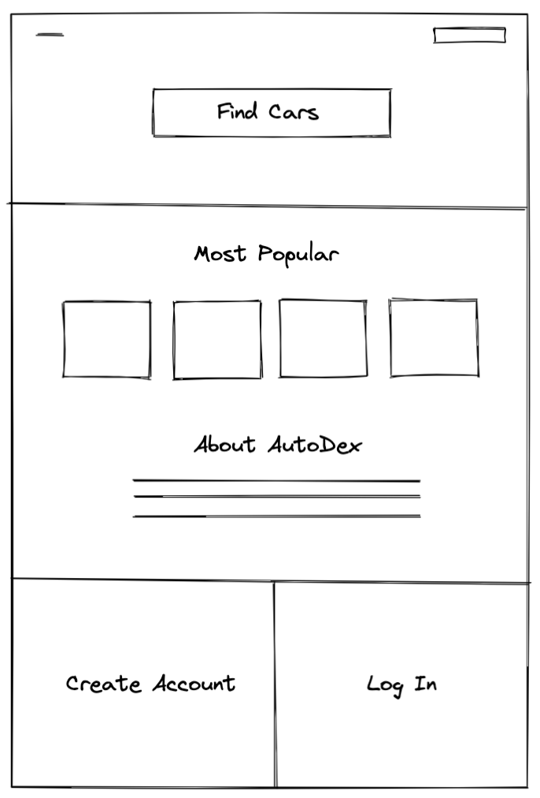

# `AutoDex`

## Introduction

AutoDex is a simple vehicle search application that allows you to save favorite cars to your account. It uses the NHTSA API to pull vehicle information and pulls images from the Unsplash API at intervals of 50 per hour due to limits on the free API.

## Unsplash API pull

``` Javascript
async function unsplashImages() {
  db.car.findAll({
    where: {
      updated_img: false
    }
  })
  .then(async carimg => {
    console.log(carimg[0].dataValues);
    for (let i = 0; i < 50; i++) {
      let index = carimg[i].dataValues;
      let getCarImage = await axios.get(`${uSplashBaseURL}search/photos?orientation=landscape&page=1&per_page=1&query=${index.make.replaceAll(' ', '+')}+${index.model.replaceAll(' ', '+')}&${uSplashEnd}`)
      .catch(err => {console.log(err)})
      let imgURL = getCarImage.data.results[0].urls.full;
      let addImagesToDatabase = db.car.update({
        updated_img: true,
        image: `${imgURL}`
      },
      {
        where: {
          make: index.make,
          model: index.model
        }
      })
    }
    console.log('IMAGES ADDED:', addImagesToDatabase)
  })
  .catch(err => {console.log(err)})
  .finally(() => {console.log('ADDING IMAGES COMPLETED')});
}

```

## NHTSA API pull

``` javascript
async function getCarData() {
  let carsArray = [];
  let pullCarMakesData = await axios.get(`${baseURL}${allMakes}${endOfURL}`)
  .catch(err => {console.log('INITIAL CAR API PULL ERROR:', err)})
  let pulledCarMakesData = pullCarMakesData.data.Results;
  pulledCarMakesData.forEach(async (carMake) => {
    let authenticate = true;
    if(
        carMake.Country === 'UNITED STATES (USA)' 
        && carMake.Mfr_CommonName !== null 
        && carMake.Mfr_CommonName !== 'Daimler Trucks ' 
        && carMake.Mfr_CommonName !== 'Volvo (Truck / Bus)' 
        && carMake.Mfr_CommonName !== 'Navistar'
        && carMake.Mfr_CommonName !== 'Buel'
        && carMake.Mfr_CommonName !== 'Peterbilt'
      ) {
      let pullCarModelsData = await axios.get(`${baseURL}${allModelsByMake}${carMake.Mfr_CommonName.replaceAll(' ', '%20')}${endOfURL}`)
      .catch(err => {console.log('ANOTHER ERROR', err)})
      let pulledCarModelsData = pullCarModelsData.data.Results;
      console.log('BIG ERROR', pulledCarModelsData);

      pulledCarModelsData.forEach(carModel => {
        db.car.findOrCreate(
          {
          where: {
            make: `${carModel.Make_Name}`,
            model: `${carModel.Model_Name}`,
          }
        })
      })
    }
  })
}

```

## Wireframe




### Default Routes

| Method | Path | Location | Purpose |
| ------ | ---------------- | -------------- | ------------------- |
| GET | / | server.js | Home page |
| GET | /auth/login | auth.js | Login form |
| GET | /auth/signup | auth.js | Signup form |
| POST | /auth/login | auth.js | Login user |
| POST | /auth/signup | auth.js | Creates User |
| GET | /auth/logout | auth.js | Removes session info |
| GET | /profile | server.js | Regular User Profile |
| DELETE | /favorites/delete/id | /controllers/cars.js | Deletes from favorites

## Installation Instructions
`1` Git clone https://github.com/lrakoto/auto-dex

`2` Install the current dependencies that are listed inside of `package.json`
```text
npm install
```
Installations Instructions
git clone https://github.com/romebell/supreme-engine.git
cd supreme-engine
npm install
touch .env
and add inside .env file
SECRET_SESSION=yaaaaaaayayyyyyayyayay
If there an API key
go to said webiste and get an API KEY
put this inside of their .env file
API_KEY=.......
create a database
npm install sequelize-cl
npx sequelize-cli db:create supreme-engine
migrate their database
npx sequelize-cli db:migrate
if they need to seed data
npx sequelize-cli db:seed:all
Start the server
npm start
