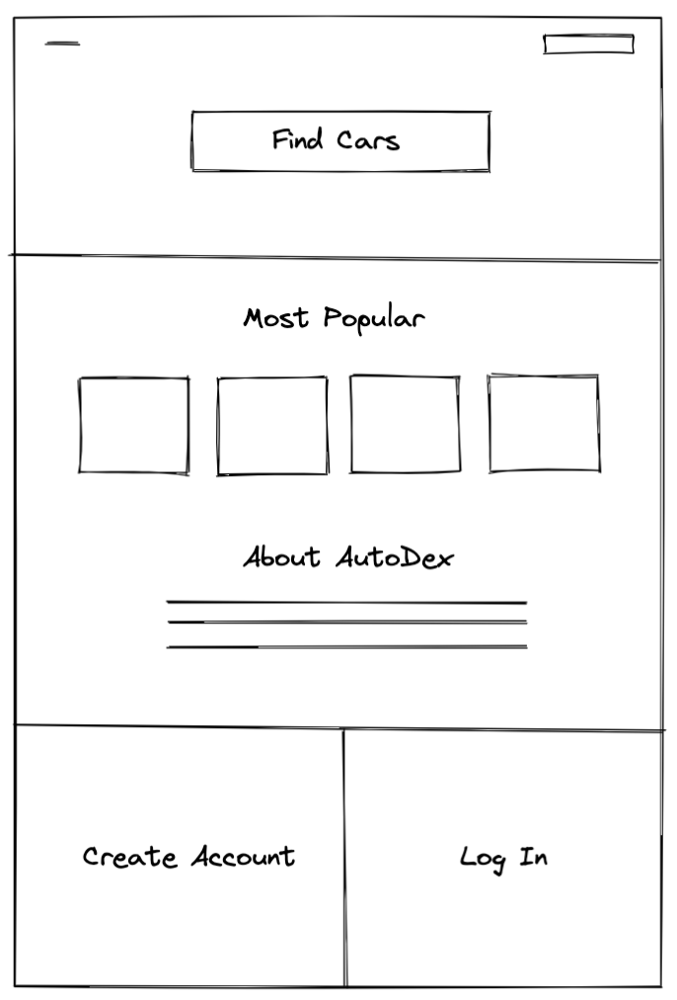

# `AutoDex`

## Introduction

AutoDex is a simple vehicle search application that allows you to save favorite cars to your account. It uses the NHTSA API to pull vehicle information and pulls images from the Unsplash API at intervals of 50 per hour due to limits on the free API.

## Unsplash API pull

``` Javascript
async function unsplashImages() {
  db.car.findAll({
    where: {
      updated_img: false
    }
  })
  .then(async carimg => {
    console.log(carimg[0].dataValues);
    for (let i = 0; i < 50; i++) {
      let index = carimg[i].dataValues;
      let getCarImage = await axios.get(`${uSplashBaseURL}search/photos?orientation=landscape&page=1&per_page=1&query=${index.make.replaceAll(' ', '+')}+${index.model.replaceAll(' ', '+')}&${uSplashEnd}`)
      .catch(err => {console.log(err)})
      let imgURL = getCarImage.data.results[0].urls.full;
      let addImagesToDatabase = db.car.update({
        updated_img: true,
        image: `${imgURL}`
      },
      {
        where: {
          make: index.make,
          model: index.model
        }
      })
    }
    console.log('IMAGES ADDED:', addImagesToDatabase)
  })
  .catch(err => {console.log(err)})
  .finally(() => {console.log('ADDING IMAGES COMPLETED')});
}

```

## NHTSA API pull

``` javascript
async function getCarData() {
  let carsArray = [];
  let pullCarMakesData = await axios.get(`${baseURL}${allMakes}${endOfURL}`)
  .catch(err => {console.log('INITIAL CAR API PULL ERROR:', err)})
  let pulledCarMakesData = pullCarMakesData.data.Results;
  pulledCarMakesData.forEach(async (carMake) => {
    let authenticate = true;
    if(
        carMake.Country === 'UNITED STATES (USA)' 
        && carMake.Mfr_CommonName !== null 
        && carMake.Mfr_CommonName !== 'Daimler Trucks ' 
        && carMake.Mfr_CommonName !== 'Volvo (Truck / Bus)' 
        && carMake.Mfr_CommonName !== 'Navistar'
        && carMake.Mfr_CommonName !== 'Buel'
        && carMake.Mfr_CommonName !== 'Peterbilt'
      ) {
      let pullCarModelsData = await axios.get(`${baseURL}${allModelsByMake}${carMake.Mfr_CommonName.replaceAll(' ', '%20')}${endOfURL}`)
      .catch(err => {console.log('ANOTHER ERROR', err)})
      let pulledCarModelsData = pullCarModelsData.data.Results;
      console.log('THIRD ERROR', pulledCarModelsData);

      pulledCarModelsData.forEach(carModel => {
        db.car.findOrCreate(
          {
          where: {
            make: `${carModel.Make_Name}`,
            model: `${carModel.Model_Name}`,
          }
        })
      })
    }
  })
}

```

## Wireframe




### Default Routes

| Method | Path | Location | Purpose |
| ------ | ---------------- | -------------- | ------------------- |
| GET | / | server.js | Home page |
| GET | /auth/login | auth.js | Login form |
| GET | /auth/signup | auth.js | Signup form |
| POST | /auth/login | auth.js | Login user |
| POST | /auth/signup | auth.js | Creates User |
| GET | /auth/logout | auth.js | Removes session info |
| GET | /profile | server.js | Regular User Profile |
| DELETE | /favorites/delete/id | /controllers/cars.js | Deletes from favorites
| PUT | /favorites/edit/id | /controllers/cars.js | Updated favorite car image


## Installation Instructions
`1` Git clone https://github.com/lrakoto/auto-dex

`2` Install the current dependencies that are listed inside of `package.json`
```text
npm install
```

`3` Create .env file
```text
touch .env
```

`4` Add credentials to .env
```
SECRET_SESSION="yoursession"
UKEY="Unsplash.com API key here"
USKEY="Unsplash.com API Secret key here"
```

`5` Create database
```
npm install sequelize-cl
npx sequelize-cli db:create "databasename"
```

`7` Create database
```
npm install sequelize-cl
npx sequelize-cli db:create "databasename"
```

`8` Start server
```
npm start
```

## Deployment

AutoDex runs behind nginx on a Hetzner (or any Ubuntu/Debian) VM. The `deploy/` directory contains a one-shot setup script that installs everything from scratch.

### First-time server setup

1. Create a new server on Hetzner Cloud (Ubuntu 22.04 LTS, CX22 or larger).
2. Point DNS for `autodx.io` and `www.autodx.io` (A records) to the new server's IP.
3. SSH in as root and run:

```bash
bash <(curl -fsSL https://raw.githubusercontent.com/lrakoto/auto-dex/main/deploy/setup.sh)
```

This installs Node.js, PostgreSQL, nginx, certbot (Let's Encrypt), UFW, and fail2ban; clones the repo to `/opt/autodex`; creates the database, runs migrations, and starts the app via systemd. The local DB password and `DATABASE_URL` are written to `.env` automatically.

4. Fill in the remaining secrets in `.env` (see `.env.example`):

```bash
nano /opt/autodex/.env
```

5. Restart the app to pick up the new env:

```bash
systemctl restart autodex
```

### Common operations

```bash
systemctl status autodex       # app status
journalctl -u autodex -f       # live app logs
systemctl restart autodex     # restart after env change
autodex-update                # pull latest + migrate + restart
sudo certbot renew --dry-run  # test TLS renewal
```

### Files

| File | Purpose |
| ---- | ------- |
| `deploy/setup.sh`     | One-shot server bootstrap (run once on a fresh VM) |
| `deploy/update.sh`    | Pull latest code, migrate, restart (run on each deploy) |
| `deploy/autodex.service` | systemd unit — auto-restarts the app on crash/reboot |
| `deploy/nginx.conf`   | nginx site: HTTPS, reverse proxy to :3000, security headers |
| `.env.example`        | Template for all required environment variables |